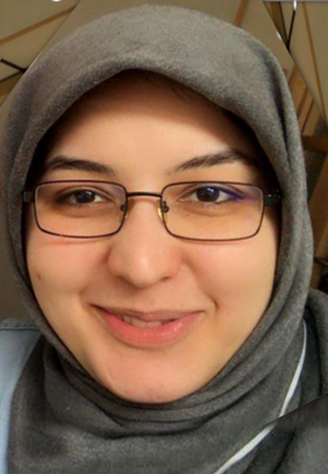

.. Personal Github page, created by
   sphinx-quickstart on September 2024.
   

Salma Kazemi Rashed
===================================

About me-I am a soon-to-be PhD in data science (AI/ML/engineer) with a strong foundation in programming, machine learning, and data-driven problem-solving, with a particular focus on biomedical and health data. I hold dual Master’s degrees in Electrical Engineering and Bioinformatics, through which I have developed solid expertise in mathematics, statistics, and AI/ML model development for complex biological and clinical datasets. During my Ph.D., I led several applied machine learning projects involving large-scale biomedical text analysis, high-content microscopy, and medical histopathology imaging. My work has centered on designing and optimizing models to extract meaningful insights from heterogeneous, multimodal data, while building scalable pipelines and ensuring reproducibility through robust engineering practices.

More recently, I have expanded into business- and user-focused applications, developing AI agents, large language model (LLM) systems, and API-based solutions. I am highly motivated to apply advanced AI and machine learning techniques to real-world challenges, continuously refining algorithms and creating innovative, data-driven solutions that drive both scientific discovery and practical impact across technology and data-driven domains.

.. toctree::
   :maxdepth: 1
   :caption: Projects

   
   new-feature   
   neo4j-graph-database
   some-feature
   NLP-feature
   RAG-feature 
   Course-feature
   Visualization
   Vision-Languation-Action-RL
   Google-Cloud-ML
   AI-agents

   

 
   
